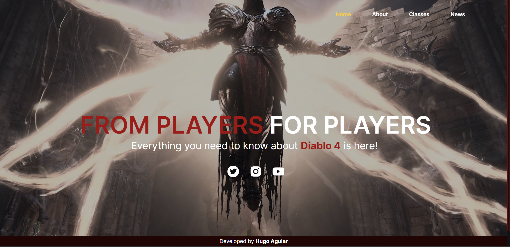

<h1 style="color: #c62828; font-weight: bold">Diablo4 Game Blog</h1>

Diablo4 Game Blog is a web application that serves as a blog for the popular game Diablo IV. It is built using React and uses various dependencies to enhance the user experience.




 <h2 style="color: #6a1b9a; font-weight: bold">🚀 Getting Started</h2>

To get started with Diablo4 Game Blog, follow the steps below:

Prerequisites

Node.js installed on your local machine

npm or yarn package manager installed on your local machine

<h2 style="color: #6a1b9a; font-weight: bold">Installation</h2>

Clone the repository to your local machine using git clone https://github.com/aguiarHugo/diablo4-game-blog.git.
Navigate to the project directory using cd diablo4-game-blog.
Installing Dependencies
Diablo4 Game Blog requires several dependencies to be installed. You can install them using npm or yarn package manager. Run the following command to install the dependencies:

```
npm install
```
or
```
yarn install
```

The following dependencies will be installed:

<h2 style="color: #6a1b9a; font-weight: bold">Dependencies</h2>

<span style="color: #6a1b9a">framer-motion</span>: "^10.11.6"

<span style="color: #6a1b9a">react</span>: "^18.2.0"

<span style="color: #6a1b9a">react-anchor-link-smooth-scroll</span>: "^1.0.12"

<span style="color: #6a1b9a">react-dom</span>: "^18.2.0"

<span style="color: #6a1b9a">react-icons</span>: "^4.8.0"

<span style="color: #6a1b9a">react-router-dom</span>: "^6.10.0"

<h2 style="color: #6a1b9a; font-weight: bold">Dev Dependencies</h2>

<span style="color: #6a1b9a">@types/react</span>: "^18.0.28"

<span style="color: #6a1b9a">@types/react-dom</span>: "^18.0.11"

<span style="color: #6a1b9a">@vitejs/plugin-react</span>: "^3.1.0"

<span style="color: #6a1b9a">autoprefixer</span>: "^10.4.14"

<span style="color: #6a1b9a">postcss</span>: "^8.4.21"

<span style="color: #6a1b9a">tailwindcss</span>: "^3.3.1"

<span style="color: #6a1b9a">vite</span>: "^4.2.0"


<h2 style="color: #6a1b9a; font-weight:bold">🌐 Starting the Development Server</h2>

After installing the dependencies, you can start the development server using the following command:

```
npm run dev
```
or
```
yarn dev
```

This will start the development server and open the application in your default web browser.

<h2 style="color: #6a1b9a; font-weight:bold">🏗️ Building the Project</h2>
To build the project for production, you can use the following command:

```
npm run build
```

or

```
yarn build
```

This will generate a production-ready build of the application